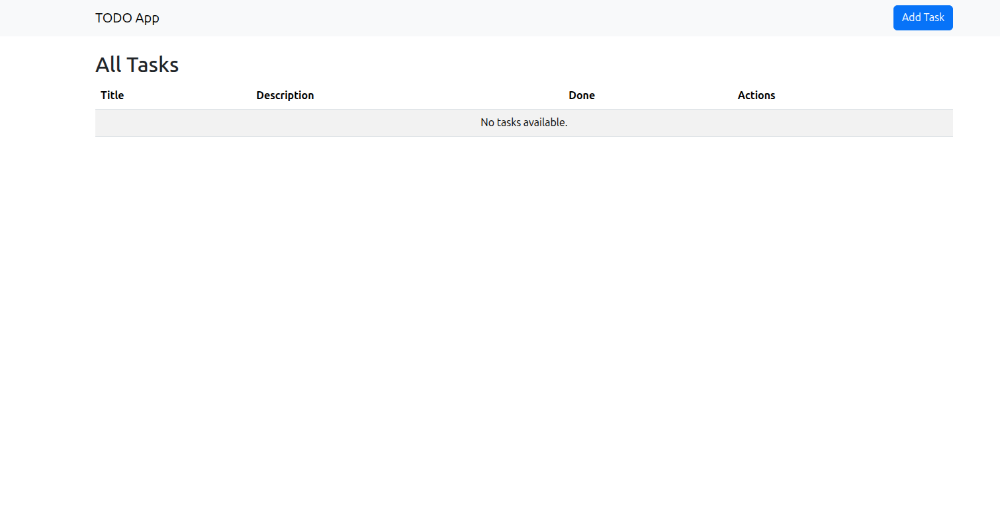
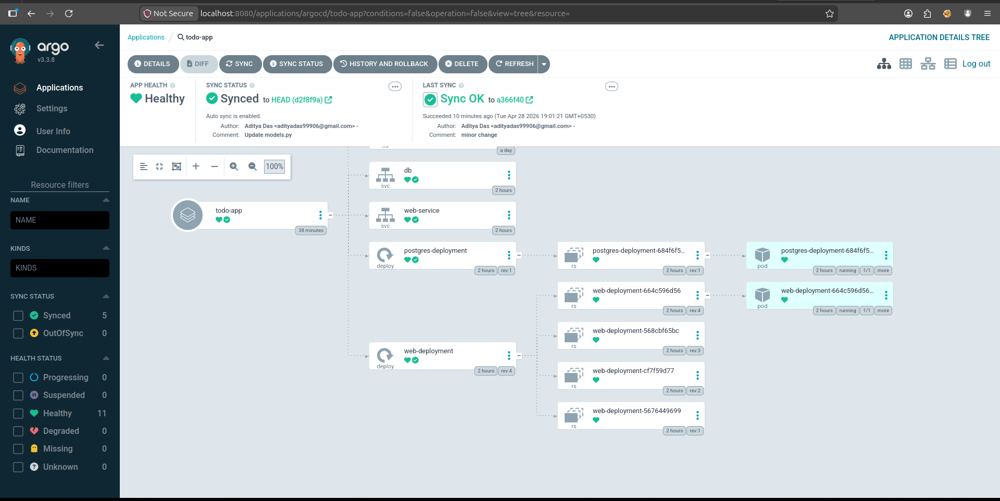

# Django Todo Application

A simple Todo application built with Django and PostgreSQL, containerized using Docker Compose and deployable to Kubernetes with Ingress.

## Prerequisites

- [Docker](https://docs.docker.com/get-docker/)
- [Docker Compose](https://docs.docker.com/compose/install/)
- [Kind](https://kind.sigs.k8s.io/) (for Kubernetes deployment)
- [kubectl](https://kubernetes.io/docs/tasks/tools/) (for managing Kubernetes clusters)

## Getting Started with Docker Compose

1. Navigate to the project folder:

   ```bash
   cd TODO_APP
   ```

2. Build and run the containers using Docker Compose:

   ```bash
   docker compose up -d
   ```

3. Run the database migrations (if it's your first time or if you've added new models):

   ```bash
   docker compose exec web python manage.py migrate
   ```

4. Access the application in your browser at:
   [http://127.0.0.1:8000](http://127.0.0.1:8000)

## Project Structure

- `TODO_APP/` - The main Django project configuration (Settings, URLs, etc.)
- `todo/` - The Todo application logic
- `docker-compose.yml` - Defines the `web` (Django) and `db` (PostgreSQL) services
- `Dockerfile` - Multi-stage build for the Django application image
- `requirements.txt` - Python dependencies needed for the project
- `k8s/` - Kubernetes manifests (deployment, service, ingress, namespace)
- `config.yml` - Kind cluster configuration

## Useful Commands (Docker Compose)

- **Create an admin superuser:**

  ```bash
  docker compose exec web python manage.py createsuperuser
  ```

  _(You can then access the admin panel at `http://127.0.0.1:8000/admin`)_

- **Stop the containers:**

  ```bash
  docker compose down
  ```

- **View live logs:**

  ```bash
  docker compose logs -f web
  ```

- **Restart the application:**
  ```bash
  docker compose restart web
  ```

---

# Kubernetes Deployment Guide

## Step 1: Create a Kind Cluster

**What it does:** Creates a local Kubernetes cluster using Kind (Kubernetes in Docker).

**Use case:** Setting up a local development environment for testing Kubernetes applications.

### Steps:

1. **Install Kind** (if not already installed):
   ```bash
   curl -Lo ./kind https://kind.sigs.k8s.io/dl/v0.20.0/kind-linux-amd64
   chmod +x ./kind
   sudo mv ./kind /usr/local/bin/kind
   ```

2. **Create the cluster:**
   ```bash
   kind create cluster --name aditya-cluster --config=config.yml
   ```

3. **Verify the cluster:**
   ```bash
   kubectl get nodes
   ```

   **Example Output:**
   ```
   NAME                           STATUS   ROLES           AGE   VERSION
   aditya-cluster-control-plane   Ready    control-plane   5m    v1.31.2
   aditya-cluster-worker          Ready    <none>          5m    v1.31.2
   aditya-cluster-worker2         Ready    <none>          5m    v1.31.2
   aditya-cluster-worker3         Ready    <none>          5m    v1.31.2
   ```

---

## Step 2: Deploy Application to Kubernetes

1. **Create the namespace:**
   ```bash
   kubectl apply -f k8s/namespace.yml
   ```

2. **Deploy PostgreSQL and Django:**
   ```bash
   kubectl apply -f k8s/deployment.yml
   ```

3. **Create Services:**
   ```bash
   kubectl apply -f k8s/service.yml
   ```

4. **Run database migrations:**
   ```bash
   kubectl exec deployment/web-deployment -n todo -- python manage.py migrate
   ```

5. **Verify pods are running:**
   ```bash
   kubectl get pods -n todo
   ```

---

## Step 3: Set Up Ingress (Production-like Local Access)

### What is Ingress?

Ingress is a Kubernetes object that manages external HTTP/HTTPS access to services inside the cluster. It acts as a reverse proxy, routing requests to your application based on hostnames and paths.

### Why Use It?

- Production-like networking setup on local machine
- Single entry point for all traffic
- Can manage multiple services and hostnames
- SSL/TLS termination capability

### Setup Steps:

#### 3.1 Label Worker Nodes

The nginx ingress controller requires worker nodes to be labeled. This tells Kubernetes where the ingress controller should run.

```bash
kubectl label nodes aditya-cluster-worker aditya-cluster-worker2 aditya-cluster-worker3 ingress-ready=true
```

**What this does:** Marks worker nodes so the ingress controller pod will be scheduled on them.

#### 3.2 Install Nginx Ingress Controller

```bash
kubectl apply -f https://raw.githubusercontent.com/kubernetes/ingress-nginx/controller-v1.8.1/deploy/static/provider/kind/deploy.yaml
```

**Wait for it to be ready:**
```bash
kubectl wait --namespace ingress-nginx --for=condition=ready pod --selector=app.kubernetes.io/component=controller --timeout=120s
```

#### 3.3 Apply Ingress Configuration

```bash
kubectl apply -f k8s/ingress.yml
```

**Verify ingress is created:**
```bash
kubectl get ingress -n todo
```

Expected output:
```
NAME          CLASS    HOSTS       ADDRESS   PORTS   AGE
web-ingress   nginx    localhost             80      10s
```

#### 3.4 Set Up Port Forwarding

The ingress controller is exposed via a NodePort service. Forward port 8080 on your local machine to the ingress controller:

```bash
kubectl port-forward -n ingress-nginx svc/ingress-nginx-controller 8080:80 &
```

**What this does:** Routes traffic from your local `127.0.0.1:8080` to the ingress controller inside the cluster.

#### 3.5 Configure Your Local /etc/hosts File

Add localhost mapping so your browser sends the correct Host header:

```bash
sudo bash -c 'echo "127.0.0.1 localhost" >> /etc/hosts'
```

**Verify it was added:**
```bash
grep "127.0.0.1 localhost" /etc/hosts
```

#### 3.6 Access Your Application

Open your browser and go to:
```
http://localhost:8080
```



Your Django application should now be accessible through the ingress controller!

---


# Troubleshooting Guide

<details>
<summary><b>Problem 1: Ingress Controller Pod Stuck in Pending</b></summary>

**Error:**
```
Warning  FailedScheduling  3m  default-scheduler  0/4 nodes available: 4 node(s) didn't match Pod's node affinity/selector
```

**Cause:**
The ingress controller pod has a node selector requirement `ingress-ready=true`, but the nodes aren't labeled with this label.

**Solution:**

1. Label all worker nodes:
   ```bash
   kubectl get nodes
   kubectl label nodes <node-name-1> <node-name-2> <node-name-3> ingress-ready=true
   ```

   Example with your cluster:
   ```bash
   kubectl label nodes aditya-cluster-worker aditya-cluster-worker2 aditya-cluster-worker3 ingress-ready=true
   ```

2. Wait for the pod to become ready:
   ```bash
   kubectl get pods -n ingress-nginx -w
   ```

</details>

<details>
<summary><b>Problem 2: 404 Not Found When Accessing Ingress</b></summary>

**Error:**
```
404 Not Found
nginx
```

**Cause:**
The Host header is not being sent correctly. Ingress uses the Host header to route requests, and without it, nginx can't find a matching route.

**Solution:**

1. Add to `/etc/hosts`:
   ```bash
   sudo bash -c 'echo "127.0.0.1 localhost" >> /etc/hosts'
   ```

2. Verify the entry:
   ```bash
   cat /etc/hosts | grep localhost
   ```

3. Access via hostname (not IP):
   ```bash
   curl -H "Host: localhost" http://127.0.0.1:8080
   # or
   http://localhost:8080  (in browser)
   ```


   
   **Why this works:** Your browser will automatically send `Host: localhost` header when you visit `http://localhost:8080`, allowing the ingress to route correctly.

</details>

<details>
<summary><b>Problem 3: Pods Stuck in CrashLoopBackOff with MySQLdb Error</b></summary>

**Error:**
```
django.core.exceptions.ImproperlyConfigured: Error loading MySQLdb module. Did you install mysqlclient?
```

**Cause:**
The Kubernetes deployment pulled an older version of the image from Docker Hub that still expected MySQL instead of PostgreSQL.

**Solution:**

1. Rebuild the local Docker image:
   ```bash
   docker build -t aditya81888/todo-app:latest .
   ```

2. Load the image into the Kind cluster:
   ```bash
   kind load docker-image aditya81888/todo-app:latest --name aditya-cluster
   ```

3. Ensure `imagePullPolicy: IfNotPresent` is set in `k8s/deployment.yml` (already configured).

4. Restart the deployment:
   ```bash
   kubectl rollout restart deployment/web-deployment -n todo
   ```

5. Check logs:
   ```bash
   kubectl logs deployment/web-deployment -n todo
   ```

</details>

<details>
<summary><b>Problem 4: Database Relation "todo_task" Does Not Exist</b></summary>

**Error:**
```
relation "todo_task" does not exist
```

**Cause:**
The newly deployed PostgreSQL database is empty. Django migrations haven't been run yet, so the database tables don't exist.

**Solution:**

Run migrations inside the web container:
```bash
kubectl exec deployment/web-deployment -n todo -- python manage.py migrate
```

Verify the tables were created by checking the logs:
```bash
kubectl logs deployment/web-deployment -n todo
```

</details>

<details>
<summary><b>Problem 5: Port-Forward Connection Refused</b></summary>

**Error:**
```
Failed to connect to localhost port 8080 after 0 ms: Couldn't connect to server
```

**Cause:**
The port-forward process isn't running or crashed.

**Solution:**

1. Check if port-forward is running:
   ```bash
   ps aux | grep "port-forward"
   ```

2. If not running, start it again:
   ```bash
   kubectl port-forward -n ingress-nginx svc/ingress-nginx-controller 8080:80 &
   ```

3. Verify it's listening:
   ```bash
   sudo netstat -tlnp | grep 8080
   # or
   ss -tlnp | grep 8080
   ```

4. If port 8080 is already in use, use a different port:
   ```bash
   kubectl port-forward -n ingress-nginx svc/ingress-nginx-controller 9090:80 &
   # Then access at http://localhost:9090
   ```

</details>

<details>
<summary><b>Problem 6: Cannot Delete Kind Cluster</b></summary>

**Error:**
```
Error: cluster not found
```

**Solution:**

1. List all existing clusters:
   ```bash
   kind get clusters
   ```

2. Delete the specific cluster:
   ```bash
   kind delete cluster --name aditya-cluster
   ```

3. Verify it's deleted:
   ```bash
   kind get clusters
   ```

</details>

<details>
<summary><b>Problem 7: Checking Ingress Logs</b></summary>

**Command to view ingress controller logs:**
```bash
kubectl logs -n ingress-nginx deployment/ingress-nginx-controller -f
```

**Look for these patterns:**
- `Successfully reloaded` - Configuration is valid and applied
- `NGINX reload triggered` - Changes detected and applied
- `Scheduled for sync` - Ingress rule registered
- Request logs at the bottom showing `200` status codes

**Example successful log line:**
```
127.0.0.1 - - [28/Apr/2026:12:00:57 +0000] "GET / HTTP/1.1" 200 1080 "-" "curl/8.5.0"
```

</details>

---

## Docker Troubleshooting

<details>
<summary><b>Problem 8: "Error loading MySQLdb module" in Docker Compose</b></summary>

**Error:**
```
django.core.exceptions.ImproperlyConfigured: Error loading MySQLdb module. Did you install mysqlclient?
```

**Cause:**
`settings.py` was configured for MySQL instead of PostgreSQL.

**Solution:**
The database engine has been updated to correctly use `'django.db.backends.postgresql'` whenever the `DB_HOST` environment variable is detected. Rebuild and restart:

```bash
docker compose down
docker compose up -d
docker compose exec web python manage.py migrate
```

</details>

---

## Complete Kubernetes Workflow

### Fresh Start (Delete Everything and Restart)

```bash
# Delete the old cluster
kind delete cluster --name aditya-cluster

# Create a new cluster
kind create cluster --name aditya-cluster --config=config.yml

# Label nodes
kubectl label nodes aditya-cluster-worker aditya-cluster-worker2 aditya-cluster-worker3 ingress-ready=true

# Install ingress controller
kubectl apply -f https://raw.githubusercontent.com/kubernetes/ingress-nginx/controller-v1.8.1/deploy/static/provider/kind/deploy.yaml
kubectl wait --namespace ingress-nginx --for=condition=ready pod --selector=app.kubernetes.io/component=controller --timeout=120s

# Deploy application
kubectl apply -f k8s/namespace.yml
kubectl apply -f k8s/deployment.yml
kubectl apply -f k8s/service.yml
kubectl apply -f k8s/ingress.yml

# Run migrations
kubectl exec deployment/web-deployment -n todo -- python manage.py migrate

# Port-forward
kubectl port-forward -n ingress-nginx svc/ingress-nginx-controller 8080:80 &

# Update /etc/hosts
sudo bash -c 'echo "127.0.0.1 localhost" >> /etc/hosts'

# Access at http://localhost:8080
```


---

## Useful Kubernetes Commands

```bash
# View all resources in the todo namespace
kubectl get all -n todo

# View pod logs
kubectl logs pod/<pod-name> -n todo

# View deployment logs
kubectl logs deployment/<deployment-name> -n todo -f

# Describe a resource to see detailed information
kubectl describe pod/<pod-name> -n todo

# Execute command in a pod
kubectl exec -it <pod-name> -n todo -- bash

# Port-forward a service
kubectl port-forward -n <namespace> svc/<service-name> <local-port>:<service-port> &

# View ingress status
kubectl describe ingress web-ingress -n todo

# Scale a deployment
kubectl scale deployment/<deployment-name> -n todo --replicas=3

# Check node labels
kubectl get nodes --show-labels
```

---

## Project Workflow Summary

1. **Develop locally** with Docker Compose for quick iteration
2. **Test on Kubernetes** using Kind for production-like deployment
3. **Use Ingress** for production-like networking and routing
4. **Monitor logs** with `kubectl logs` for debugging
5. **Scale as needed** with kubectl scale commands

---

## ArgoCD Dashboard & GitOps

ArgoCD is used for continuous delivery and GitOps. Below is the dashboard showing the synchronized state of the application.



### ArgoCD Quick Setup

1. **Install:** `kubectl apply -n argocd -f https://raw.githubusercontent.com/argoproj/argo-cd/stable/manifests/install.yaml`
2. **Access:** `kubectl port-forward svc/argocd-server -n argocd 8081:443`
3. **Password:** `kubectl -n argocd get secret argocd-initial-admin-secret -o jsonpath="{.data.password}" | base64 -d`

For advanced ArgoCD help, visit my [ArgoCD Git Repository](https://github.com/Aditya-das-4707-e/argocd-in-one-shot).
